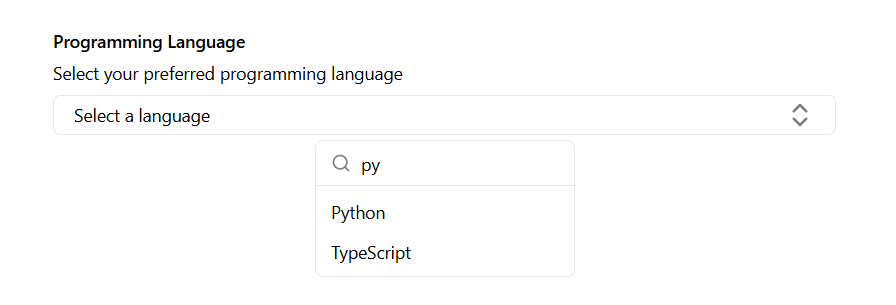
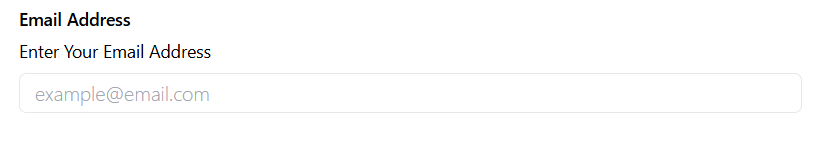

This is a [Next.js](https://nextjs.org) project bootstrapped with [`create-next-app`](https://nextjs.org/docs/app/api-reference/cli/create-next-app).

## USAGE OF THE COMPONENTS

### MulaCustomAutoComplete
### Preview


```bash
npm install @your-org/my-ui-library@0.2.2
```


Install the package using npm:
```bash
npm install @your-org/my-ui-library@0.2.2
```

### Usage

```
import { MulabCustomAutocomplete } from "@your-org/my-ui-library";

const FormComponent = () => {
const languageOptions = [
    { label: "Java", value: "java" },
    { label: "Python", value: "python" }
]

const form = useForm()
const onSubmit = (data: any) => {
    console.log(data)
}
return (
    <Form {...form}>
        <form onSubmit={form.handleSubmit(onSubmit)}>
            <MulabCustomAutocomplete
            control={form.control}
            name="language"
            label="Programming Language"
            description="Select your preferred programming language"
            placeholder="Select a language"
            items={languageOptions}
        />
        </form>
    </Form>
)}
```
configure the form using the following safelist in the `tailwind.comfig.ts` file when using ``tailwind version 3``.
```
    module.exports = {
    content: [
        "./src/**/*.{js,ts,jsx,tsx}",
        "./node_modules/your-component-library/dist/**/*.{js,ts,jsx,tsx}"
    ],
    safelist: [
		'bg-popover',
		'text-popover-foreground',
		'flex',
		'h-full',
		'w-full',
		'overflow-hidden',
		'rounded-md',
		'max-h-[300px]',
		'overflow-x-hidden',
		'overflow-y-auto',
		'py-6',
		'text-center',
		'text-sm',
		'text-foreground',
		'overflow-hidden',
		'p-1',
		'px-2',
		'py-1.5',
		'text-xs',
		'font-medium',
		'bg-border',
		'h-px',
		'data-[selected=true]:bg-accent',
		'data-[selected=true]:text-accent-foreground',
		'relative',
		'flex',
		'cursor-default',
		'items-center',
		'gap-2',
		'rounded-sm',
		'px-2',
		'py-1.5',
		'outline-hidden',
		'select-none',
		'data-[disabled=true]:pointer-events-none',
		'data-[disabled=true]:opacity-50',
		'text-muted-foreground',
		'size-4',
		'shrink-0',
		'ml-auto',
		'tracking-widest',
	
		// MulabCustomAutocomplete related
		'text-sm',
		'font-normal',
		'placeholder:font-light',
		'w-full',
		'justify-between',
		'h-8',
		'text-muted-foreground',
		'h-9',
		'cursor-pointer',
		'hover:bg-accent',
		'hover:bg-red-400',
		'opacity-50',
		'h-4',
		'w-4',
		'opacity-100',
		'opacity-0',
	
		// Form components
		'flex',
		'flex-col',
		"bg-white",
		// data-slot and cmdk-group-heading specific styles
		'[&_[cmdk-group-heading]]:text-muted-foreground',
		'[&_[cmdk-group-heading]]:px-2',
		'[&_[cmdk-group-heading]]:font-medium',
		'[&_[cmdk-group]]:px-2',
		'[&_[cmdk-group]:not([hidden])_~[cmdk-group]]:pt-0',
		'[&_[cmdk-input-wrapper]_svg]:h-5',
		'[&_[cmdk-input-wrapper]_svg]:w-5',
		'[&_[cmdk-input]]:h-12',
		'[&_[cmdk-item]]:px-2',
		'[&_[cmdk-item]]:py-3',
		'[&_[cmdk-item]_svg]:h-5',
		'[&_[cmdk-item]_svg]:w-5',
		'[&_[cmdk-group-heading]]:text-muted-foreground',
		'[&_[cmdk-group-heading]]:px-2',
		'[&_[cmdk-group-heading]]:py-1.5',
		'[&_[cmdk-group-heading]]:text-xs',
		'[&_[cmdk-group-heading]]:font-medium',
	
		// CommandInput wrapper
		'flex',
		'h-9',
		'items-center',
		'gap-2',
		'border-b',
		'px-3',
		'placeholder:text-muted-foreground',
		'h-10',
		'bg-transparent',
		'py-3',
		'outline-none',
		'disabled:cursor-not-allowed',
		'disabled:opacity-50',

	  ],
    theme: {
        extend: {},
    },
    plugins: [],
    }

```

##
### MulabInput
### Preview



Install the package using npm:
```bash
npm install @your-org/my-ui-library@0.2.2
```

### Usage

```
import { MulabInput } from "@your-org/my-ui-library";

const FormComponent = () => {

const form = useForm()
const onSubmit = (data: any) => {
    console.log(data)
}
return (
    <Form {...form}>
        <form onSubmit={form.handleSubmit(onSubmit)}>
            <MulabInput
            control={form.control}
            name="username"
            label="Email Address"
            description="Enter Your Email Address"
            placeholder="example@email.com"
            type="email"
            />
        />
        </form>
    </Form>
)}
```
##


Open [http://localhost:3000](http://localhost:3000) with your browser to see the result.

You can start editing the page by modifying `app/page.tsx`. The page auto-updates as you edit the file.

This project uses [`next/font`](https://nextjs.org/docs/app/building-your-application/optimizing/fonts) to automatically optimize and load [Geist](https://vercel.com/font), a new font family for Vercel.

## Learn More

To learn more about Next.js, take a look at the following resources:

- [Next.js Documentation](https://nextjs.org/docs) - learn about Next.js features and API.
- [Learn Next.js](https://nextjs.org/learn) - an interactive Next.js tutorial.

You can check out [the Next.js GitHub repository](https://github.com/vercel/next.js) - your feedback and contributions are welcome!

## Deploy on Vercel

The easiest way to deploy your Next.js app is to use the [Vercel Platform](https://vercel.com/new?utm_medium=default-template&filter=next.js&utm_source=create-next-app&utm_campaign=create-next-app-readme) from the creators of Next.js.

Check out our [Next.js deployment documentation](https://nextjs.org/docs/app/building-your-application/deploying) for more details.
